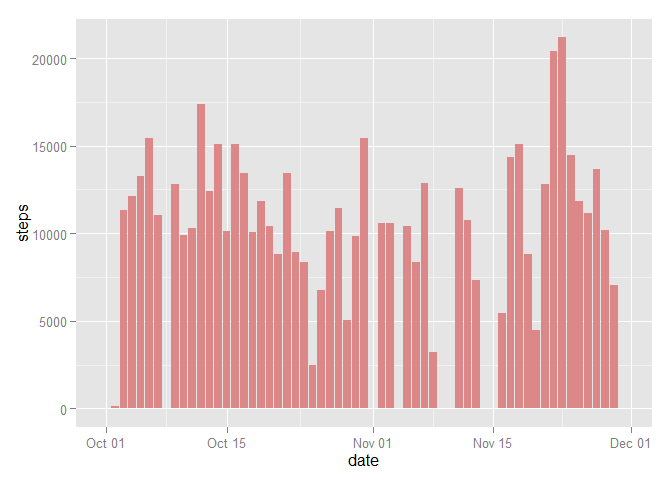
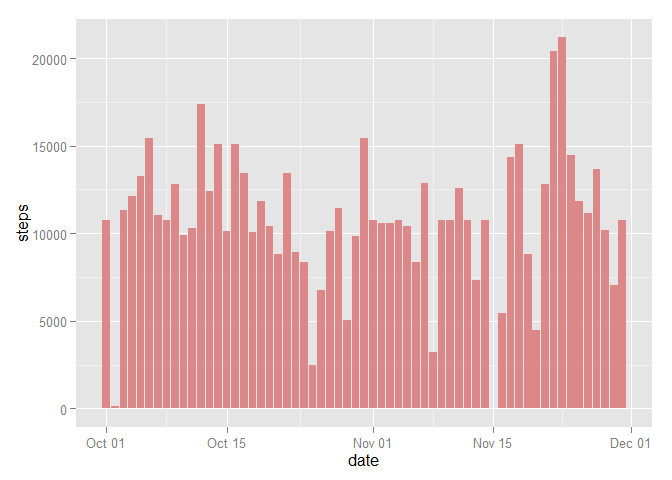

# Reproducible Research: Peer Assessment 1

## Loading and preprocessing the data

Data is loaded and the date field is converted to Date data type. 


```r
download.file(url="https://d396qusza40orc.cloudfront.net/repdata%2Fdata%2Factivity.zip", destfile="activity.zip")
unzip(zipfile="activity.zip")

df = read.csv(file="activity.csv", stringsAsFactors = F)
df$date = as.POSIXct(df$date,format="%Y-%m-%d")
```


## What is mean total number of steps taken per day?

Summarize the total number of steps taken per day.

```r
library(ggplot2,quietly=T)
library(dplyr,quietly=T)

steps_perday = df %>% group_by(date) %>% summarise(steps=sum(steps, na.rm=T))
```

The mean:

```r
mean(steps_perday$steps)
```

```
## [1] 9354.23
```

The median:

```r
median(steps_perday$steps)
```

```
## [1] 10395
```

The plot of total number of steps taken per day:


```r
g = ggplot(steps_perday,aes(x=date,y=steps))
g + geom_bar(stat="identity",fill="#DD8888")
```

 


## What is the average daily activity pattern?

The plot showing average steps taken per each interval:

```r
steps_perinterval = df %>% group_by(interval) %>% summarise(steps=mean(steps, na.rm=T))
g = ggplot(steps_perinterval,aes(x=interval,y=steps))
g + geom_line()
```

 

The maximum number of steps is taken by following interval:

```r
steps_perinterval[steps_perinterval$steps==max(steps_perinterval$steps),]$interval
```

```
## [1] 835
```


## Imputing missing values

Check for NA value:

```r
apply(df, 2, function(x) length(which(is.na(x))))
```

```
##    steps     date interval 
##     2304        0        0
```

Certain date has NA value for all of the observation on that date. Using average steps on those dates to replace the NA value is not feasible. Using average number of steps taken per day with the same interval is more feasible. Also, by using mean per interval, we hope to preserve the daily trend for steps taken.

New data set, replacing NA value in steps with the average number of steps taken per day with the same interval:

```r
df2 = df %>% 
  mutate(steps = ifelse(is.na(steps),steps_perinterval$steps[steps_perinterval$interval %in% interval],steps))
```

Summarise the new data set:

```r
steps_perday2 = df2 %>% group_by(date) %>% summarise(steps=sum(steps, na.rm=T))
```

The new mean:

```r
mean(steps_perday2$steps)
```

```
## [1] 10766.19
```

The new median:

```r
median(steps_perday2$steps)
```

```
## [1] 10766.19
```

The new mean and median differ from the data set with NA value.
Because we are using mean to replace NA value, the impact to total daily number of steps is that on some date, the total daily number of steps is equals to sum of means of steps per interval.

The plot from new data set:

```r
g = ggplot(steps_perday2,aes(x=date,y=steps))
g + geom_bar(stat="identity",fill="#DD8888")
```

 


## Are there differences in activity patterns between weekdays and weekends?

The plot shows difference activity patterns between weekdays and weekends:

```r
df2 = df2 %>% mutate(week=ifelse(weekdays(date)=='Saturday'|weekdays(date)=='Sunday','weekend','weekday'))

steps_perinterval2 = df2 %>% group_by(week,interval) %>% summarise(steps=mean(steps, na.rm=T))
g = ggplot(steps_perinterval2,aes(x=interval,y=steps))
g + geom_line() + facet_wrap(~ week, nrow=2)
```

 

